# Buckets

An time based interpolating stack, each element in the stack interpolates by it's previous element and it's set value. When an element has elapsed the set duration it's previous element is deleted keeping only alive elements in the stack.



```shell
npm i @mkja/buckets
```

```javascript
import Bucket from "@mkja/buckets";

const canvas = document.createElement("canvas");
document.body.appendChild(canvas);

canvas.width = canvas.clientWidth;
canvas.height = canvas.clientHeight;

const bucketX = new Bucket(canvas.width / 2, { duration: 2000, easing: (x) => x * x * x });

const bucketY = new Bucket(canvas.height / 2, { duration: 2000, easing: (x) => x * x * x });

canvas.addEventListener("mousemove", (e) => {
  let [x, y] = [e.clientX, e.clientY];
  bucketX.write(x);
  bucketY.write(y);
});

const ctx = canvas.getContext("2d");

function draw() {
  ctx.clearRect(0, 0, canvas.width, canvas.height);
  const tail = { x: bucketX.stack, y: bucketY.stack };

  const segments = tail.x.map((_, i) => {
    i = tail.x.length - 1 - i;
    const pos = { x: tail.x[i], y: tail.y[i] };
    return pos;
  });

  let lineWidth = 12;

  segments.forEach((segment, i) => {
    ctx.beginPath();
    if (i == 0) {
      ctx.moveTo(segment.x, segment.y);

      return;
    } else {
      ctx.moveTo(segments[i - 1].x, segments[i - 1].y);
    }

    ctx.lineTo(segment.x, segment.y);

    let f = i / segments.length;
    ctx.lineWidth = 1 + (1 - f) * lineWidth;
    ctx.strokeStyle = `hsla(0,50%,50%,${1 - f})`;

    ctx.stroke();
  });

  const firstSegment = segments[0];

  if (firstSegment) {
    ctx.beginPath();
    ctx.arc(firstSegment.x, firstSegment.y, lineWidth / 2, 0, Math.PI * 2);
    ctx.fillStyle = "hsl(0,50%,50%)";
    ctx.fill();
  }

  requestAnimationFrame(draw);
}

requestAnimationFrame(draw);
```
